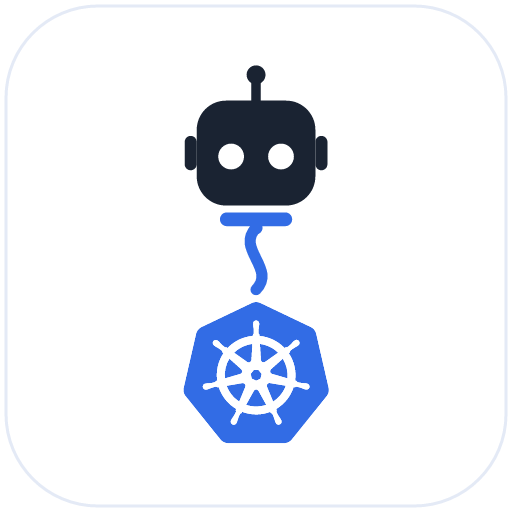

<div align="center">
  
  <h1>kubeleash</h1>
  <p><strong>Point it at your over-privileged kubeconfig — it still can't nuke prod.</strong></p>
</div>

[](https://github.com/kubeleash/kubeleash/actions/workflows/ci.yml)
[](https://goreportcard.com/report/github.com/kubeleash/kubeleash)
[](https://scorecard.dev/viewer/?uri=github.com/kubeleash/kubeleash)
[](LICENSE)


**Guardrails for AI agents on your cluster.** kubeleash is a local
[MCP](https://modelcontextprotocol.io) server for Kubernetes whose
differentiator is RBAC-style, *context-scoped* access control. Point it at a
kubeconfig — even a cluster-admin one — and a local policy file constrains what
the agent can actually do, **per kube context**, with destructive actions gated
**before any call reaches the cluster**.

> **Pre-release.** The v0.1 server is implemented and runs today **from
> source** (see [Quickstart](#quickstart)), but there is no tagged release yet —
> the Homebrew / `go install` / container channels below light up on the first
> tag. Watch/star to follow along.

<div align="center">

### Add kubeleash to your AI client

[](https://insiders.vscode.dev/redirect/mcp/install?name=kubeleash&config=%7B%22name%22%3A%22kubeleash%22%2C%22command%22%3A%22kubeleash%22%2C%22args%22%3A%5B%22--policy%22%2C%22%24%7Binput%3ApolicyPath%7D%22%5D%2C%22inputs%22%3A%5B%7B%22id%22%3A%22policyPath%22%2C%22type%22%3A%22promptString%22%2C%22description%22%3A%22Path%20to%20your%20kubeleash%20policy.yaml%22%7D%5D%7D) &nbsp; [](#install) &nbsp; [](#install)

<sub>Pre-release: install launches the local <code>kubeleash</code> binary, so <a href="#quickstart">build it first</a>. VS Code installs in one click; Cursor &amp; Claude open the <a href="#install">setup steps</a> (GitHub strips the <code>cursor://</code> one-click link, so it lives there as copy-paste).</sub>

</div>

## Why

Most Kubernetes MCP servers inherit the kubeconfig's permissions wholesale —
whatever the credentials grant, the agent can do. kubeleash adds three things
native RBAC can't express for this use case:

- **Constrain the agent independently of the credentials.** Effective access is
  always `kubeconfig-grants ∩ policy-allows` — kubeleash only ever *subtracts*.
- **Context-aware guardrails.** Policy varies by context (prod vs staging vs
  dev); native RBAC is per-cluster.
- **Block destructive verbs** (`delete`/`exec`/…) as a safety net against agent
  mistakes and prompt injection.

## Policy in 10 seconds

```yaml
policies:
  - contexts: ".*prod.*"          # regex over the active context name
    allow:
      resources: ["*"]
      verbs: [get, list, watch]   # read-only in prod
    deny:
      verbs: [exec]               # never, regardless of credentials
```

Deny wins. Default deny. A broken policy refuses to start — it never fails open.

See [`examples/policy.yaml`](examples/policy.yaml) for a fuller, commented policy
(read-only prod, broader staging, namespace-scoped dev).

## Quickstart

No release yet, so run it from source (Go 1.26+):

```bash
git clone https://github.com/kubeleash/kubeleash && cd kubeleash
go build -o kubeleash ./cmd/kubeleash

# See how kubeleash validates and normalizes a policy (no cluster needed):
./kubeleash --policy examples/policy.yaml --print-effective-policy

# Try it without touching any cluster — every decision is logged, nothing runs:
./kubeleash --policy examples/policy.yaml --dry-run
```

Then point an MCP client at it (see [below](#use-it-as-an-mcp-server)). kubeleash
speaks MCP over stdio, so it's launched by your client, not run as a daemon.

| Flag | Purpose |
|------|---------|
| `--policy <path>` | Policy file. **Required** (or set `K8S_MCP_POLICY`); with neither, kubeleash refuses to start — default-deny never fails open. |
| `--kubeconfig <path>` | Explicit kubeconfig. Omit to use the standard client-go rules (`$KUBECONFIG`, `~/.kube/config`). |
| `--dry-run` | Evaluate + log every decision, but never execute against a cluster. |
| `--print-effective-policy` | Print the resolved/normalized rules and exit. |
| `--log-level <level>` | `debug` / `info` / `warn` / `error` (default `info`). The audit log is JSON on **stderr** (stdout is the MCP transport). |
| `--version` | Print version, commit, and build date. |

## Install

All channels run kubeleash **locally over stdio** — your client launches the
binary; nothing is hosted.

### One-click

The **Add to Cursor / VS Code** buttons
[at the top](#add-kubeleash-to-your-ai-client) are the fastest path (they need
the `kubeleash` binary on PATH — see [Manual](#manual)). Other clients:

**Claude Code** — this repo is its own plugin marketplace:

```shell
/plugin marketplace add kubeleash/kubeleash
/plugin install kubeleash@kubeleash
```

The plugin also ships two skills — `using-kubeleash` (how an agent should query
and act through the gated tools) and `authoring-kubeleash-policy` (how to write
the policy) — so the agent understands the guardrails, not just the tool list.

**Claude Desktop** *(on first release)* — download `kubeleash.mcpb` from the
[releases page](https://github.com/kubeleash/kubeleash/releases) and
double-click it; the bundle ships the binary and prompts you for the policy and
kubeconfig.

<details>
<summary>Raw Cursor / VS Code deeplink URLs (if a button doesn't fire)</summary>

Cursor (can't prompt — edit the placeholder path afterward in *Settings → MCP*).
Decodes to `{"command":"kubeleash","args":["--policy","/absolute/path/to/policy.yaml"]}`:

```
cursor://anysphere.cursor-deeplink/mcp/install?name=kubeleash&config=eyJjb21tYW5kIjoia3ViZWxlYXNoIiwiYXJncyI6WyItLXBvbGljeSIsIi9hYnNvbHV0ZS9wYXRoL3RvL3BvbGljeS55YW1sIl19
```

VS Code (prompts for the policy path):

```
vscode:mcp/install?%7B%22name%22%3A%22kubeleash%22%2C%22command%22%3A%22kubeleash%22%2C%22args%22%3A%5B%22--policy%22%2C%22%24%7Binput%3ApolicyPath%7D%22%5D%2C%22inputs%22%3A%5B%7B%22id%22%3A%22policyPath%22%2C%22type%22%3A%22promptString%22%2C%22description%22%3A%22Path%20to%20your%20kubeleash%20policy.yaml%22%7D%5D%7D
```

</details>

### Manual

```bash
# Homebrew (on first release)
brew install kubeleash/tap/kubeleash

# Go
go install github.com/kubeleash/kubeleash/cmd/kubeleash@latest

# Container (great for running the MCP server sandboxed)
docker run --rm -i -v ~/.kube:/root/.kube:ro -v ./policy.yaml:/policy.yaml:ro \
  ghcr.io/kubeleash/kubeleash --policy /policy.yaml
```

> kubeleash runs **locally over stdio** and talks only to your clusters. There
> is intentionally **no remote/hosted URL connector** — it would mean handing
> your cluster credentials to a third party.

## Use it as an MCP server

kubeleash exposes 8 generic, GVK-agnostic tools (`k8s_list`, `k8s_get`,
`k8s_apply`, `k8s_delete`, `k8s_logs`, `k8s_exec`, `k8s_scale`, and
`k8s_capabilities`) that work for any resource, including CRDs. Every call is
checked against your policy and recorded to a JSON audit log on stderr (stdout
is the MCP transport). It speaks MCP over stdio — point your client at the
binary (or container):

```jsonc
// Claude Desktop / Cursor / VS Code MCP config
{
  "mcpServers": {
    "kubeleash": {
      "command": "kubeleash",
      "args": ["--policy", "/absolute/path/to/policy.yaml"],
      "env": { "KUBECONFIG": "/absolute/path/to/kubeconfig" }
    }
  }
}
```

## Privacy

**Zero telemetry. No phone-home. Local-only by design.** kubeleash talks only to
the Kubernetes API servers you point it at — there is intentionally no remote or
hosted connector to route your cluster credentials through. That's a feature, not
a gap: you run it against real clusters with privileged credentials, so nothing
should sit between the agent and your API server but the leash.

## Project

- [Design](docs/design.md) · [Contributing](CONTRIBUTING.md) ·
  [Security & threat model](SECURITY.md) · [Code of Conduct](CODE_OF_CONDUCT.md)
- License: [Apache-2.0](LICENSE)
